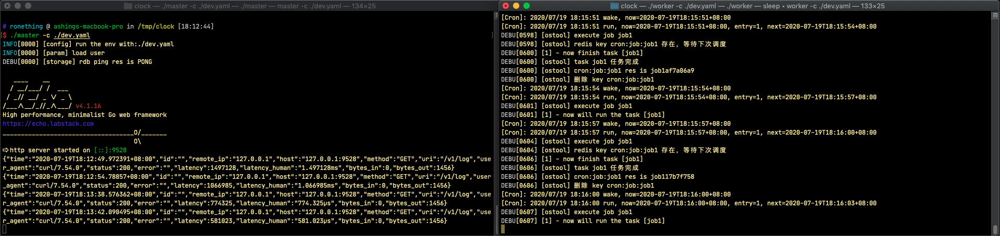

## Clock
基于 go cron 和 redis 实现分布式任务调度(支持多 worker，多 master)

## 地址
https://github.com/ronething/clock

## 环境
* 后端
    * go 1.13+
    * [cron](https://github.com/robfig/cron) - 定时调度器
    * [echo](https://github.com/labstack/echo) - web 框架
    * [mongo-go-driver](https://github.com/mongodb/mongo-go-driver) - mongo 驱动
    * [go-redis](https://github.com/go-redis/redis)  - redis 客户端
    * [msgpack](https://github.com/vmihailenco/msgpack) - redis 信息传输序列化

## 使用

### 直接使用

下载 release 中的文件, 需要启动一个 redis 服务器,数据库使用 mongo

```
# ronething @ ashings-macbook-pro in /tmp/clock [18:17:21] C:130
$ ll
total 99264
-rw-r--r--  1 ronething  wheel    32K  7 19 18:17 clock.db
-rw-r--r--  1 ronething  wheel   521B  7 19 18:05 dev.yaml
-rwxr-xr-x  1 ronething  wheel    26M  7 19 18:12 master
-rwxr-xr-x  1 ronething  wheel    23M  7 19 18:05 worker

# ronething @ ashings-macbook-pro in /tmp/clock [18:17:21] C:130
$ ./master -c ./dev.yaml

# ronething @ ashings-macbook-pro in /tmp/clock [18:17:21] C:130
$ ./worker -c ./dev.yaml

```

### 自行构建
```
# 进入项目目录
# 分别在 master 和 worker 目录下进行构建
cd master && go build
./master -c ../config/dev.yaml

cd worker && go build
./worker -c ../config/dev.yaml
```

### docker 构建

注： `go mod vendor` 很重要，如果更新了 go.mod 请执行此命令对 vendor 文件夹进行更新

```sh
make docker-build-master version=0.0.1
make docker-build-worker version=0.0.1
```

### Api

<details>
<summary>展开查看</summary>
<pre><code>
- 获取所有任务

`GET /v1/task`

- 获取单个任务

`GET /v1/task/:tid`

- 更新单个任务

`PUT /v1/task`

- 删除单个任务

`DEL /v1/task/:tid`

- 获取日志

`GET /v1/log`

```go
	v1 := e.Group("/v1")
	{
		//v1.Use(middleware.JWTWithConfig(createJWTConfig())) 暂时取消登录中间件
		t := v1.Group("/task")
		{
			t.GET("", controller.GetTasks)
			t.GET("/:tid", controller.GetTask)
			t.PUT("", controller.PutTask)
			t.GET("/run", controller.RunTask)
			t.DELETE("/:tid", controller.DeleteTask)
			t.GET("/status", controller.GetTaskStatus)
		}

		l := v1.Group("/log")
		{
			l.GET("", controller.GetLogs)
			l.DELETE("", controller.DeleteLogs)
		}
```

### 效果

```sh
# ronething @ ashings-macbook-pro in /tmp/clock [18:07:20]
$ curl -X PUT \
  http://127.0.0.1:9528/v1/task \
  -H 'Content-Type: application/json' \
  -d '{
    "command": "sleep 5;echo job10",
    "name": "job1",
    "log_enable": true,
    "expression": "*/3 * * * * *"
}'
{"code":200,"msg":"success","data":1}
```

```json
# ronething @ ashings-macbook-pro in /tmp/clock [18:12:50]
# 查看 log
$ curl -X GET "http://127.0.0.1:9528/v1/log" | jq
  % Total    % Received % Xferd  Average Speed   Time    Time     Time  Current
                                 Dload  Upload   Total   Spent    Left  Speed
100  1456  100  1456    0     0   189k      0 --:--:-- --:--:-- --:--:--  203k
{
  "code": 200,
  "msg": "success",
  "data": {
    "items": [
      {
        "lid": "b6420f9b",
        "tid": 1,
        "std_out": "job10\n",
        "std_err": "",
        "start_at": 1595153520,
        "end_at": 1595153525,
        "create_at": 1595153525
      },
      {
        "lid": "91cc293f",
        "tid": 1,
        "std_out": "job10\n",
        "std_err": "",
        "start_at": 1595153514,
        "end_at": 1595153519,
        "create_at": 1595153519
      }
    ],
    "page": {
      "count": 10,
      "index": 1,
      "total": 35,
      "order": "",
      "left_ts": 0,
      "right_ts": 0,
      "lid": "",
      "tid": 0,
      "std_out": "",
      "std_err": "",
      "start_at": 0,
      "end_at": 0,
      "create_at": 0
    }
  }
}
```
</code></pre>
</details>


